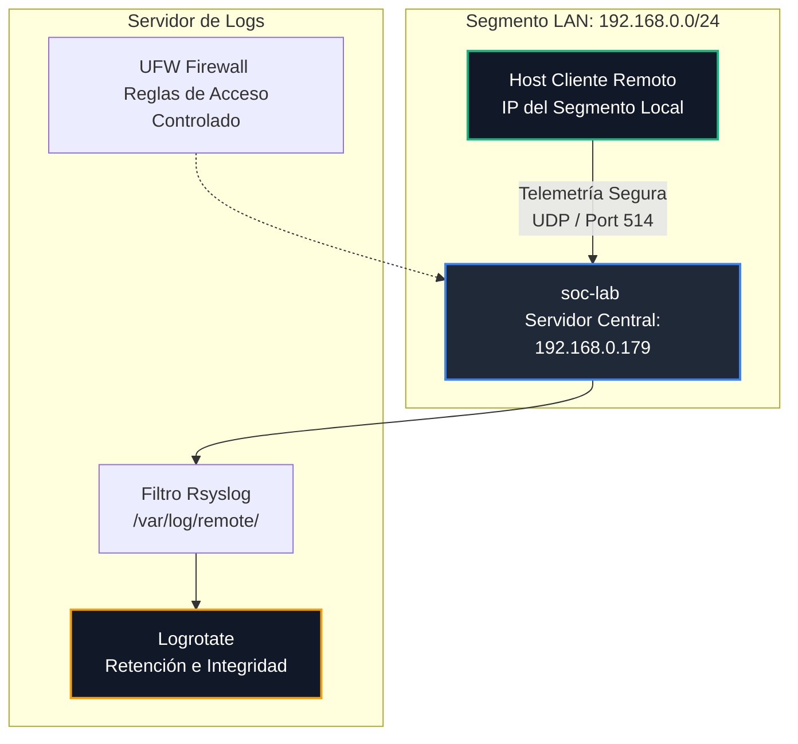

# CentralLog-Architecture 🚀

## 📌 Presentación del Proyecto
Este proyecto despliega una infraestructura robusta de ingeniería de sistemas para la centralización, auditoría y protección de logs del sistema en entornos Linux. El laboratorio simula una arquitectura de nivel empresarial, pero optimizada minuciosamente para correr de forma eficiente en un entorno virtualizado con recursos limitados.

## 🎯 Objetivo General
Centralizar y asegurar de manera automatizada las trazas de eventos procedentes de clientes remotos hacia un único servidor centralizado mediante **Rsyslog**, garantizando la integridad de los datos a través de políticas estrictas de retención con **Logrotate** y aplicando controles defensivos con el firewall **UFW** para proteger el sistema contra accesos no autorizados y el colapso de disco.

---

## 📊 Arquitectura de la Red (Topología del Laboratorio)

A continuación se detalla el flujo de la telemetría, el direccionamiento IP y los controles defensivos implementados entre los nodos:

👤 Autor

Eduardo (Eduar) - Ingeniero Informático & Entusiasta de la Ciberseguridad

GitHub: Mi Perfil de GitHub

LinkedIn: Mi Perfil de LinkedIn

Proyecto desarrollado con mentalidad autodidacta, enfocado en la optimización extrema de recursos y hardening de sistemas operativos.
